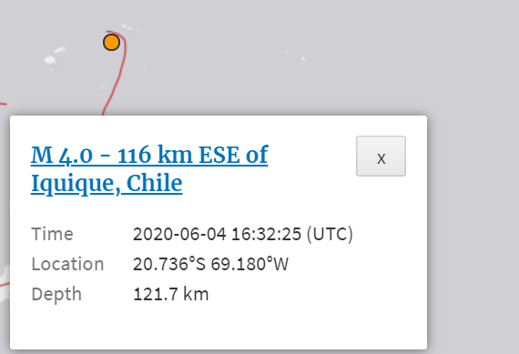

# Earthquake_Webmap

### Background of the project
This is web map called [**earthquake hazards program**](https://earthquake.usgs.gov/earthquakes/map/#%7B%22autoUpdate%22%3A%5B%22autoUpdate%22%5D%2C%22basemap%22%3A%22grayscale%22%2C%22feed%22%3A%2230day_m25%22%2C%22listFormat%22%3A%22default%22%2C%22mapposition%22%3A%5B%5B-67.474922384787%2C-3226.2890625%5D%2C%5B67.7427590666639%2C-2888.7890625%5D%5D%2C%22overlays%22%3A%5B%22plates%22%5D%2C%22restrictListToMap%22%3A%5B%22restrictListToMap%22%5D%2C%22search%22%3Anull%2C%22sort%22%3A%22newest%22%2C%22timezone%22%3A%22utc%22%2C%22viewModes%22%3A%5B%22map%22%2C%22list%22%5D%2C%22event%22%3A%22us6000a2yn%22%7D), namely the map has collected and listed all earthquakes that happened over the world no matter the magnitude until today. Users who observe this map are able to gain a big picture of where do the earthquakes happen and how much intensity do they caused each time. There are two ways to represent the data on this map, which are color scheme and circle size. 

The color indicates *the time of earthquake that occurred*. It particularly measures the how many days or hours away from the earthquake happened. From the map, we can observe that the darker the color of circle, the farther away from the day of the seismic occurred. Another data that visualizes by the map is *the magnitude*, which is the earthquakes inherent intensity. This data is represented by the circle size and obviously, the larger size of the circle, the greater shaking intensity of the earthquake itself. 
### Author and the Affiliation
This web map is developed by **national earthquake information center (NEIC)** and posted on the **U.S Geological Survey (USGS) website**, which is a sole science agency for the department of the interior and which created by an act of Congress in 1879. This real time earthquake project serves as a function of monitoring and reporting earthquakes, assessing earthquake impacts and hazards, and performing research into the causes and effects of earthquakes. Besides, it also seen as a resource to inform the public and allow the public to be aware and pay attention to the latest earthquake news. 
### Intended Audience
As I mentioned above, the intended audience of this project could be the general public who concern these by providing the latest and credible earthquake information. It also attracts such organization that tries to minimize loss of life and property caused by natural disasters. Additionally, this project not just has a map of the American earthquake; it also has several earthquake maps about other countries. Hence, displaying the global and U.S specific maps demonstrates that NEIC desire to reach a larger audience than just the American demographic.
### Analysis
The external internet side of this kind of project could be *ArcGIS online and ArcGIS Desktop* which allows the users that directly interact with the browser or the web pages. The web client also could even be some *ArcGIS story map-based apps*. Other than the external internet, the system architecture also comprised of the internal network, which contains web host and the geospatial server. This website is hosted by the USGS and it also posts through its own IP address and web server and even the geospatial server. This earthquake project mainly provides two kinds of service: **earthquake notification service (ENS) and the tweet earthquake dispatch service (TED)**. ENS is a free service that send the public automated notifications to their email address or cell phone when earthquakes happen. 

TED is another service that offers two twitter accounts. On average, each account will produce about two tweet per day. Because I didn’t find any source of data about this web map, I assume that all the information comes from the organization (NEIC)’s own monitoring equipment and technology. However, this site provides several ways to access the data such as spreadsheet format, google earth KML and GeoJSON Summary Feed specifically for those in need. Other than using Esri to develop and visualize the map, the major library that is used in this web map is leaflet, which leads open-source JavaScript library for interactive map. One of the examples of that is the pop-up window on clicking each dot. Although this map doesn’t note the specific source of data, the author uses the tile layer as the raster data to create the basic layout.

One of the data that flows between the client and server is the *basic earthquake information acquisition*. This also is one of the interactive components of this web map. When user clicks a dot that shows on the map, the web client will start the operation and then send the request to the webserver. The webserver will transmit the request to the geospatial server and geospatial server will deliver the request either to the database server or file server to extract the data that stored in that specific dot. As long as server passed the information to the client, a small window will pop up in the lower left corner of the web page and it will briefly give out the earthquake information about the datapoint that clicked by user, including time of the earthquake happened and its specific coordinate system and the depth of this earthquake. 

Additionally, this project also supports responsive design, that is *DYFL*. In the small pop up window, user is able to see a green button called IV DYFL, which stands for did you feel it. This is a button that used to collect information from people who is affected by earthquakes and create maps to show people’s experiences and the extents of destruction or damage. Other dots also function in the same way, extracting the data from the server after sending a request and displaying the quantitative data for the thematic layer since it gathers datasets that have identical feature or attribute placed in the same layer of geospatial data.

The basemap of this project is the world light grey base, which is from the arcgis online map server. Although the map doesn’t have the north arrow, there are a small bar that locates on the lower right corner, that is the longitude and latitude respectively. And each of them is followed by the abbreviation of direction. The number in the small grey bar varies as the mouse moves. Besides, it also equips some basic elements that other maps have, such as legend bar, scale bar, zoom in and zoom out button. 
### Strengths and Weakness
In the upper right corner of the map, we can easily see 4 icons side by side. They are **list, map, settings and about**. Those four different icons play an essential role in this map and in the meanwhile, they can also be seen as the biggest strength of this project. *List is an icon that can help user to do filter work, which almost works completely the same as the filter function in the excel*. When user click the icon, a window will appear on the left side of the screen and in that window, a list about all earthquakes will show up. Because this website has the capability to detect all earthquakes occur regardless of magnitude and its pretty time consuming for users to find out what they want. Hence, there are two drop-down arrows: format and sort. People can quickly find the seismic information they want based on the format options provided and the sort drop-down arrow also allows them to rank the earthquake list according to their requirement. And then followed by the map icon, that is button to decide whether to hide the map. 

The **settings button** gives users an option to choose the earthquake that occurred in how many days and so does its magnitude. This is somehow similar to the list icon, but this button works as a general filter. Besides, users are able to adjust the time zoon according to where they live. The about icon, apparently, is the place to store some related information about this web map. In addition to the four icons that I said above, there is an icon within a same web page called *zoom to* option. Users who click that drop-down arrow are able to zoom to the place wherever they want. Except it includes the U.S map, this project also provides an option called World which allows people to have a holistic picture of the global happened earthquakes. 

This map looks perfect but it still has some weaknesses from my perspective. For example, it doesn’t have the default extent button. As long as users click the zoom in and zoom button, they will lose their way in the map since they don’t know where they are. Besides, readers could observe that the most color that represent the time on the map is orange. One of the big concerns for me regarding that is the circle of overlap. Although various places may have different levels of magnitude, some of them still have the possibility of overlapping with other circles, which is a little bit inconvenient for reader to look at the map. 
### Social Theories
Some people might feel that investigating such topic and collect the relevant data are pretty boring and useless. However, this project means a lot for the entire society. In the United States, natural disasters such as earthquake and hurricane threaten lives and livelihoods every year and cause billions of dollars in losses. A public platform now that sponsored by the congress has ability to work with many partners to monitor, evaluate, and conduct targeted research on various natural hazards so that enhance the understanding of disaster preparedness, response and resilience of the policymakers and the public. All in all, this kind of project can help protect the safety, security, and economic well-being of the nation and also provides a diverse set of expertise, data, and resources to reduce risk from multiple hazards.  
